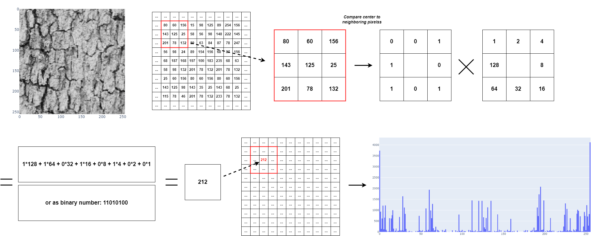

# Local Binary Pattern

Local binary pattern (LBP) is a method used to extract statistical features from grey-scale (it has been extended to color/multi channel images) images.
It was first introduced by 

> Ojala et al., “A comparative study of texture 
measures with classification based on feature distributions”. Pattern 
Recognition. 29(1), 51–59 (1996) 

It transforms the image into a histogram which describes the frequency of occurence of local patterns. 
Each entry in the histogram refers to a **pattern** occuring in the image. In the simple case we look at a pixel **c** and its surrounding 8 pixels. We compare each pixel p to the center pixel and replace them with

When reading the values clockwise this results in a binary number which can be transformed into a decimal number. Counting the occurence of each value results in the final histogram.

[comment]: <> (# Dataset)

[comment]: <> (>Dengxin Dai, Hayko Riemenschneider, and Luc Van Gool.. The Synthesizability of Texture Examples. In CVPR 2014.)

# Run the code

To download the data type the following commands in the console:

[comment]: <> (    #eth data)

[comment]: <> (    wget http://data.vision.ee.ethz.ch/daid/Synthesizability/ETH_Synthesizability.zip)

[comment]: <> (    unzip ETH_Synthesizability.zip )

    cd data
    wget https://sipi.usc.edu/database/textures.zip
    unzip textures.zip

Install the dependencies by running:

    python -m venv venv
    source venv/bin/activate
    pip install -r requirements.txt

and run the main file:

    python3 main.py
